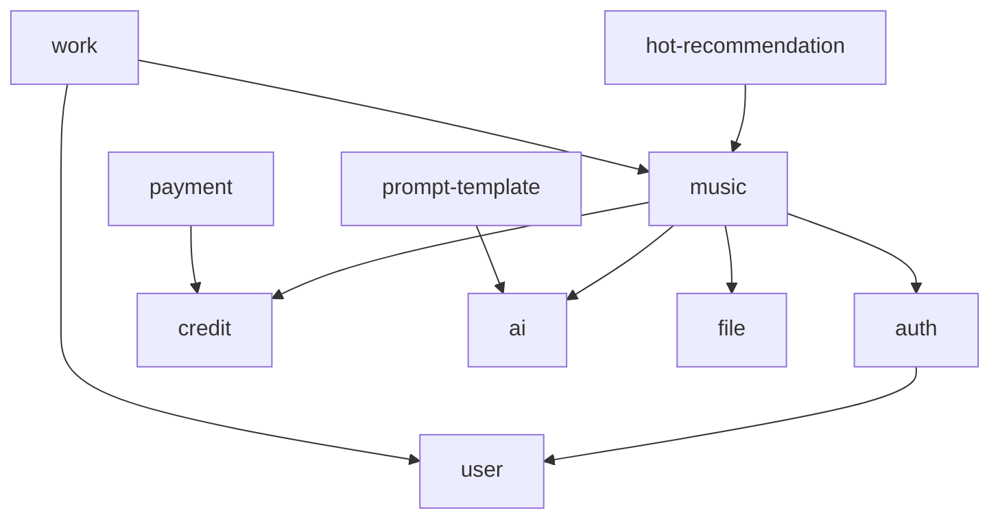

# 音乐平台项目 - 完整状态分析报告

## Executive Summary
- **分析焦点**: 全栈音乐创作平台的架构、技术栈、模块关系和开发状态
- **分析时间**: 2025-10-15
- **分析工具**: Claude Code - 上下文分析
- **整体评估**: 4/5 - 架构完整、技术现代、模块清晰、文档详尽

---

## 1. 项目架构概览

### 整体架构设计

```
┌─────────────────┐
│   微信小程序     │  (uni-app)
│  + 管理后台      │  (Vue3 + Vite)
└────────┬────────┘
         │ HTTP/HTTPS
         │ REST API
┌────────┴────────┐
│   NestJS 后端    │  (TypeScript)
│  + API Gateway  │
└────────┬────────┘
         │
    ┌────┴────┐
    │         │
┌───┴───┐ ┌──┴──┐
│ MySQL │ │Redis│
└───────┘ └─────┘
```

**架构特点**:
- ✅ **前后端分离**: 清晰的层次结构，独立部署和扩展
- ✅ **微服务化模块**: 14个后端模块，职责单一、解耦良好
- ✅ **多端支持**: 小程序 + Web管理后台
- ✅ **异步处理**: Bull 队列处理耗时任务（音乐生成、AI调用）
- ✅ **缓存策略**: Redis 缓存热点数据，提升性能

---

## 2. 目录结构分析

### 项目根目录
```
music_platform-master/
├── backend/              # NestJS 后端服务 (核心)
│   ├── src/
│   │   ├── main.ts      # 应用入口
│   │   ├── app.module.ts # 主模块
│   │   ├── modules/     # 业务模块 (14个)
│   │   ├── common/      # 通用组件
│   │   ├── config/      # 配置管理
│   │   └── database/    # 数据库脚本
│   ├── test/            # 测试文件
│   ├── uploads/         # 文件上传目录
│   ├── logs/            # 日志目录
│   └── dist/            # 编译输出
│
├── admin/               # Vue3 管理后台
│   ├── src/
│   │   ├── main.ts      # 入口文件
│   │   ├── App.vue      # 根组件
│   │   ├── views/       # 页面视图
│   │   ├── components/  # 组件库
│   │   ├── router/      # 路由配置
│   │   ├── api/         # API 接口
│   │   └── types/       # 类型定义
│   └── dist/            # 构建输出
│
├── miniprogram/         # uni-app 小程序
│   ├── pages/           # 页面 (5个主要页面)
│   │   ├── creation/    # 创作页面
│   │   ├── index/       # 首页
│   │   ├── login/       # 登录
│   │   ├── recommendations/ # 推荐
│   │   └── user/        # 用户中心
│   ├── components/      # 组件 (uni-ui + 自定义)
│   ├── api/             # API 接口
│   ├── config/          # 配置文件
│   ├── store/           # Vuex 状态管理
│   └── utils/           # 工具函数
│
├── docs/                # 项目文档 (14个文档)
│   ├── API_ROUTES_REFERENCE.md
│   ├── BACKEND_API_COMPLETION_REPORT.md
│   ├── TESTING_GUIDE.md
│   └── ... (更多文档)
│
├── .workflow/           # 工作流配置
└── .claude/             # Claude Code 配置
```

**目录组织特点**:
- ✅ **模块化结构**: 每个应用独立目录，边界清晰
- ✅ **文档完整**: 14个文档涵盖API、测试、部署等
- ✅ **配置分离**: 环境变量、配置文件独立管理
- ✅ **测试支持**: 测试目录和配置完善

---

## 3. 技术栈详解

### 后端技术栈 (NestJS)

**核心框架**:
```typescript
{
  "framework": "NestJS 10.x",         // 企业级 Node.js 框架
  "language": "TypeScript 5.x",       // 类型安全
  "runtime": "Node.js",               // 高性能异步运行时
  "architecture": "模块化 + 依赖注入"   // 可测试、可维护
}
```

**数据层**:
```typescript
{
  "database": "MySQL 2 (mysql2)",     // 关系型数据库
  "orm": "TypeORM",                    // ORM框架，迁移管理
  "cache": "Redis (ioredis)",          // 缓存 + 会话存储
  "queue": "Bull",                     // 异步任务队列
}
```

**认证与安全**:
```typescript
{
  "auth": "JWT + Passport",            // 无状态认证
  "validation": "class-validator",     // 数据验证
  "encryption": "bcrypt",              // 密码哈希
  "transformation": "class-transformer" // 数据转换
}
```

**AI 集成** (核心特性):
```typescript
{
  "claude": "@anthropic-ai/sdk ^0.65.0",    // Anthropic Claude
  "gemini": "@google/generative-ai ^0.24.1", // Google Gemini
  "openai": "openai ^6.3.0",                 // OpenAI GPT
  "suno": "自定义SDK",                       // Suno 音乐生成
}
```

**日志与监控**:
```typescript
{
  "logger": "Winston",                 // 日志框架
  "http": "axios",                     // HTTP 客户端
  "swagger": "@nestjs/swagger",        // API 文档自动生成
}
```

### 前端管理后台 (Vue3)

**核心技术**:
```typescript
{
  "framework": "Vue 3.4.x",            // 组合式API + Composition API
  "build_tool": "Vite 5.x",            // 极速构建工具
  "language": "TypeScript 5.x",        // 类型安全
  "state": "Pinia",                    // Vue3 官方状态管理
  "router": "Vue Router 4.x",          // 路由管理
}
```

**UI 与样式**:
```typescript
{
  "css_framework": "Tailwind CSS",     // 实用优先的CSS框架
  "components": "@headlessui/vue",     // 无头UI组件
  "animations": "@vueuse/motion",      // 动画库
  "charts": "echarts ^5.4.3",          // 数据可视化
  "icons": "@iconify/vue",             // 图标库
}
```

**工具库**:
```typescript
{
  "composables": "@vueuse/core",       // Vue组合式工具集
  "date": "date-fns",                  // 日期处理
  "http": "axios",                     // HTTP 客户端
  "utilities": "lodash-es",            // 工具函数库
}
```

### 小程序端 (uni-app)

**核心技术**:
```typescript
{
  "framework": "uni-app",              // 跨平台开发框架
  "ui_library": "ColorUI",             // UI组件库
  "state": "Vuex",                     // 状态管理
  "i18n": "vue-i18n",                  // 国际化
}
```

**uni-ui 组件**:
- uni-badge, uni-card, uni-list, uni-popup, uni-nav-bar
- uni-goods-nav, uni-icons, uni-tag, uni-status-bar

---

## 4. 功能模块详解 (14个后端模块)

### 模块分类

**核心业务模块**:
1. **music** - 音乐生成服务 (核心)
   - Suno API 集成
   - 异步任务处理（Bull队列）
   - 音乐文件管理
   - 生成进度跟踪

2. **ai** - AI 服务集成
   - Claude、Gemini、OpenAI 多模型支持
   - 歌词生成
   - 提示词优化
   - AI 模型路由和负载均衡

3. **ai-models** - AI 模型管理
   - 模型配置管理
   - API 密钥管理
   - 使用统计和监控
   - 成本追踪

**用户与认证模块**:
4. **auth** - 用户认证
   - JWT 认证
   - Passport 策略
   - 微信小程序登录
   - 会话管理

5. **user** - 用户管理
   - 用户CRUD
   - 用户资料
   - 权限管理
   - 用户统计

**内容与推荐模块**:
6. **hot-recommendation** - 热门推荐
   - 推荐算法
   - 播放统计
   - 用户喜好
   - 分类管理

7. **banner** - 横幅管理
   - 轮播图管理
   - 活动宣传
   - 位置配置
   - 点击统计

8. **prompt-template** - 提示词模板
   - 模板管理
   - 分类组织
   - 使用统计
   - 模板分享

**经济系统模块**:
9. **credit** - 积分系统
   - 积分充值
   - 积分消耗
   - 积分记录
   - 套餐管理

10. **payment** - 支付系统
    - 微信支付
    - 订单管理
    - 支付回调
    - 退款处理

**资源管理模块**:
11. **file** - 文件管理
    - 文件上传
    - 存储管理
    - 文件访问
    - 缩略图生成

12. **work** - 作品管理
    - 作品展示
    - 作品分享
    - 作品收藏
    - 作品评论

13. **material** - 素材管理
    - 素材库
    - 素材分类
    - 素材搜索
    - 素材收藏

**任务调度模块**:
14. **task** - 任务队列
    - Bull 任务调度
    - 异步任务处理
    - 任务状态管理
    - 失败重试

### 模块依赖关系



---

## 5. 代码关系与数据流

### API 调用链路

```
小程序/管理后台
     ↓ HTTP Request
[全局CORS中间件]
     ↓
[JWT 认证守卫] (除公开接口)
     ↓
[全局验证管道] (DTO验证)
     ↓
[业务控制器] (Controller)
     ↓
[业务服务] (Service)
     ↓
[数据访问层] (Repository)
     ↓
[数据库] (MySQL) + [缓存] (Redis)
     ↓ Response
[全局响应拦截器] (统一格式)
     ↓
[全局异常过滤器] (错误处理)
     ↓
返回客户端
```

### 认证授权流程

```
用户登录请求
     ↓
[AuthController.login]
     ↓
[AuthService.validateUser]
     ↓
[UserService.findByUsername]
     ↓
[Bcrypt 验证密码]
     ↓
[JWT 生成 Token]
     ↓
返回 { token, user }

后续请求
     ↓
[JWT 守卫验证 Token]
     ↓
[从 Token 解析用户]
     ↓
[附加到 Request.user]
     ↓
业务逻辑执行
```

### 音乐生成流程

```
用户请求生成音乐
     ↓
[MusicController.createMusic]
     ↓
[检查积分余额]
     ↓
[扣除积分 - CreditService]
     ↓
[创建任务 - Bull Queue]
     ↓
返回任务ID (立即响应)

异步处理
     ↓
[MusicTaskProcessor]
     ↓
[调用 Suno API]
     ↓
[轮询生成状态]
     ↓
[下载音乐文件]
     ↓
[保存到本地存储]
     ↓
[更新数据库记录]
     ↓
[通知用户完成]
```

---

## 6. 启动和部署方式

### 后端启动

**开发环境**:
```bash
cd backend
npm install
cp .env.example .env  # 配置环境变量
npm run start:dev      # 热重载开发模式
```

**生产环境**:
```bash
npm run build         # 编译TypeScript
npm run start:prod    # 生产模式启动
```

**环境配置** (.env):
```ini
NODE_ENV=production
PORT=3000

# 数据库
DB_HOST=localhost
DB_PORT=3306
DB_USERNAME=root
DB_PASSWORD=***
DB_DATABASE=music_platform

# Redis
REDIS_HOST=localhost
REDIS_PORT=6379

# JWT
JWT_SECRET=***
JWT_EXPIRES_IN=7d

# AI APIs
GEMINI_API_KEY=***
SUNO_API_KEY=***

# 微信
WECHAT_APPID=***
WECHAT_SECRET=***

# 存储
STORAGE_TYPE=local
STORAGE_PATH=./uploads
```

### 管理后台启动

**开发环境**:
```bash
cd admin
npm install
npm run dev           # Vite 开发服务器
```

**生产构建**:
```bash
npm run build         # 构建生产文件
npm run preview       # 预览构建结果
```

### 小程序构建

**HBuilderX**:
1. 打开 HBuilderX
2. 导入 miniprogram 目录
3. 选择 "发行" → "小程序-微信"
4. 配置 AppID
5. 点击 "上传" 发布

**CLI 构建**:
```bash
cd miniprogram
npm install
npm run build:mp-weixin  # 构建微信小程序
```

### 部署架构

**推荐部署方案**:
```
[Nginx] (反向代理 + 静态文件)
   ↓
[NestJS] (PM2 进程管理)
   ↓
[MySQL] + [Redis] (数据层)
```

**Nginx 配置示例**:
```nginx
# 后端API
location /api {
    proxy_pass http://localhost:3000;
    proxy_set_header Host $host;
    proxy_set_header X-Real-IP $remote_addr;
}

# 管理后台
location /admin {
    root /var/www/html;
    try_files $uri $uri/ /index.html;
}

# 静态文件
location /uploads {
    alias /var/www/uploads;
}
```

---

## 7. 开发进度评估

### 已完成功能 (✅)

**后端核心功能**:
- ✅ 用户认证系统 (JWT + 微信登录)
- ✅ 积分系统 (充值、消耗、记录)
- ✅ AI 模型集成 (Claude, Gemini, OpenAI)
- ✅ 音乐生成服务 (Suno API)
- ✅ 文件上传管理
- ✅ 支付系统 (微信支付)
- ✅ 热门推荐系统
- ✅ 横幅管理
- ✅ 提示词模板管理
- ✅ 任务队列处理 (Bull)
- ✅ 日志系统 (Winston)
- ✅ API 文档 (Swagger)

**前端功能**:
- ✅ 管理后台基础框架 (Vue3 + Vite)
- ✅ 小程序核心页面 (创作、推荐、用户中心)
- ✅ 状态管理 (Pinia/Vuex)
- ✅ API 接口封装

**文档和测试**:
- ✅ API 文档 (14个文档文件)
- ✅ 测试指南
- ✅ 部署文档

### 开发中功能 (🚧)

- 🚧 AI 模型管理后台界面
- 🚧 数据可视化仪表板 (echarts)
- 🚧 音乐编辑功能
- 🚧 社区互动功能
- 🚧 高级推荐算法

### 待实现功能 (📋)

**功能增强**:
- 📋 音乐混音功能
- 📋 多语言支持 (完整i18n)
- 📋 实时协作
- 📋 音乐版权管理
- 📋 社交分享优化

**性能优化**:
- 📋 CDN 加速
- 📋 图片懒加载优化
- 📋 数据库查询优化
- 📋 缓存策略完善

**安全加固**:
- 📋 API 限流 (Rate Limiting)
- 📋 DDoS 防护
- 📋 敏感数据加密存储
- 📋 审计日志

### 技术债务

**需要重构的部分**:
- ⚠️ 部分模块缺少单元测试
- ⚠️ 错误处理不够统一
- ⚠️ 日志级别需要细化
- ⚠️ 配置管理需要环境区分

**性能问题**:
- ⚠️ 大文件上传需要分片
- ⚠️ 数据库索引需要优化
- ⚠️ Redis 缓存策略需要完善

---

## 8. 关键技术实现

### JWT 认证实现

**Token 生成** (auth.service.ts):
```typescript
async login(user: any) {
  const payload = {
    username: user.username,
    sub: user.id,
    role: user.role
  };
  return {
    access_token: this.jwtService.sign(payload),
    user: user
  };
}
```

**守卫保护** (jwt-auth.guard.ts):
```typescript
@UseGuards(JwtAuthGuard)
@Get('profile')
getProfile(@Request() req) {
  return req.user;  // 从 JWT 解析的用户信息
}
```

### AI 模型集成

**多模型支持**:
```typescript
// Gemini
import { GoogleGenerativeAI } from '@google/generative-ai';

// Claude
import Anthropic from '@anthropic-ai/sdk';

// OpenAI
import { OpenAI } from 'openai';

// 统一接口
class AIService {
  async generate(prompt: string, model: 'gemini' | 'claude' | 'openai') {
    switch(model) {
      case 'gemini':
        return this.geminiService.generate(prompt);
      case 'claude':
        return this.claudeService.generate(prompt);
      case 'openai':
        return this.openaiService.generate(prompt);
    }
  }
}
```

### 文件上传处理

**MulterModule 配置**:
```typescript
MulterModule.register({
  dest: './uploads',
  limits: {
    fileSize: 10 * 1024 * 1024,  // 10MB
  },
  fileFilter: (req, file, cb) => {
    if (!file.mimetype.match(/\/(jpg|jpeg|png|gif|mp3|wav)$/)) {
      return cb(new Error('不支持的文件类型'), false);
    }
    cb(null, true);
  },
})
```

### Bull 任务队列

**任务生产者**:
```typescript
@InjectQueue('music')
private musicQueue: Queue;

async createMusicTask(data: CreateMusicDto) {
  const job = await this.musicQueue.add('generate', data, {
    attempts: 3,
    backoff: {
      type: 'exponential',
      delay: 2000,
    },
  });
  return job.id;
}
```

**任务消费者**:
```typescript
@Processor('music')
export class MusicTaskProcessor {
  @Process('generate')
  async handleGenerate(job: Job) {
    // 调用 Suno API
    // 轮询生成状态
    // 下载音乐文件
    // 更新数据库
  }
}
```

### Redis 缓存策略

**缓存装饰器**:
```typescript
@Injectable()
export class HotRecommendationService {
  async getHotMusic() {
    const cacheKey = 'hot:music:list';

    // 尝试从缓存获取
    const cached = await this.redis.get(cacheKey);
    if (cached) {
      return JSON.parse(cached);
    }

    // 从数据库查询
    const data = await this.repository.find();

    // 写入缓存，过期时间5分钟
    await this.redis.setex(cacheKey, 300, JSON.stringify(data));

    return data;
  }
}
```

---

## 9. 数据库设计

### 核心数据表

**用户表** (users):
```sql
CREATE TABLE users (
  id INT PRIMARY KEY AUTO_INCREMENT,
  username VARCHAR(50) UNIQUE NOT NULL,
  password VARCHAR(255),
  nickname VARCHAR(100),
  avatar VARCHAR(255),
  wechat_openid VARCHAR(100) UNIQUE,
  role ENUM('user', 'admin') DEFAULT 'user',
  credits INT DEFAULT 0,
  created_at TIMESTAMP DEFAULT CURRENT_TIMESTAMP,
  updated_at TIMESTAMP DEFAULT CURRENT_TIMESTAMP ON UPDATE CURRENT_TIMESTAMP
);
```

**音乐表** (music):
```sql
CREATE TABLE music (
  id INT PRIMARY KEY AUTO_INCREMENT,
  user_id INT NOT NULL,
  title VARCHAR(200),
  prompt TEXT,
  suno_task_id VARCHAR(100),
  status ENUM('pending', 'generating', 'completed', 'failed'),
  file_url VARCHAR(500),
  duration INT,
  play_count INT DEFAULT 0,
  like_count INT DEFAULT 0,
  created_at TIMESTAMP DEFAULT CURRENT_TIMESTAMP,
  FOREIGN KEY (user_id) REFERENCES users(id)
);
```

**积分记录** (credit_logs):
```sql
CREATE TABLE credit_logs (
  id INT PRIMARY KEY AUTO_INCREMENT,
  user_id INT NOT NULL,
  amount INT NOT NULL,
  type ENUM('recharge', 'consume', 'reward', 'refund'),
  description VARCHAR(500),
  balance_after INT,
  created_at TIMESTAMP DEFAULT CURRENT_TIMESTAMP,
  FOREIGN KEY (user_id) REFERENCES users(id)
);
```

**订单表** (orders):
```sql
CREATE TABLE orders (
  id INT PRIMARY KEY AUTO_INCREMENT,
  user_id INT NOT NULL,
  order_no VARCHAR(32) UNIQUE,
  package_id INT,
  amount DECIMAL(10, 2),
  status ENUM('pending', 'paid', 'cancelled', 'refunded'),
  payment_method VARCHAR(50),
  transaction_id VARCHAR(100),
  created_at TIMESTAMP DEFAULT CURRENT_TIMESTAMP,
  paid_at TIMESTAMP NULL,
  FOREIGN KEY (user_id) REFERENCES users(id)
);
```

### 索引设计

**高频查询索引**:
```sql
-- 用户登录
CREATE INDEX idx_username ON users(username);
CREATE INDEX idx_wechat_openid ON users(wechat_openid);

-- 音乐查询
CREATE INDEX idx_user_id ON music(user_id);
CREATE INDEX idx_status ON music(status);
CREATE INDEX idx_created_at ON music(created_at);

-- 积分记录
CREATE INDEX idx_user_id_created ON credit_logs(user_id, created_at DESC);

-- 订单查询
CREATE INDEX idx_user_id_created ON orders(user_id, created_at DESC);
CREATE INDEX idx_order_no ON orders(order_no);
```

---

## 10. API 接口体系

### RESTful API 设计

**路由规范**:
```
/api
├── /auth          # 认证
│   ├── POST /login
│   ├── POST /register
│   ├── POST /wechat-login
│   └── GET  /profile
│
├── /users         # 用户管理
│   ├── GET    /users
│   ├── GET    /users/:id
│   ├── PATCH  /users/:id
│   └── DELETE /users/:id
│
├── /music         # 音乐管理
│   ├── POST   /music
│   ├── GET    /music
│   ├── GET    /music/:id
│   ├── DELETE /music/:id
│   └── GET    /music/:id/status
│
├── /credits       # 积分系统
│   ├── GET  /credits/balance
│   ├── GET  /credits/logs
│   └── POST /credits/consume
│
├── /payment       # 支付
│   ├── POST /payment/orders
│   ├── POST /payment/wechat/notify
│   └── GET  /payment/orders/:id
│
├── /hot-recommendation  # 推荐
│   ├── GET /hot-recommendation
│   ├── POST /hot-recommendation/:id/like
│   └── POST /hot-recommendation/:id/play
│
└── /files         # 文件
    └── POST /files/upload
```

### 响应格式

**成功响应**:
```typescript
{
  "code": 200,
  "message": "success",
  "data": {
    // 业务数据
  }
}
```

**错误响应**:
```typescript
{
  "code": 400,
  "message": "参数错误",
  "error": "VALIDATION_ERROR",
  "details": [
    {
      "field": "username",
      "message": "用户名不能为空"
    }
  ]
}
```

### 错误码规范

```typescript
enum ErrorCode {
  SUCCESS = 200,
  BAD_REQUEST = 400,
  UNAUTHORIZED = 401,
  FORBIDDEN = 403,
  NOT_FOUND = 404,
  INTERNAL_ERROR = 500,

  // 业务错误码
  INSUFFICIENT_CREDITS = 1001,
  MUSIC_GENERATION_FAILED = 1002,
  PAYMENT_FAILED = 1003,
}
```

---

## 11. 项目亮点

### 技术亮点

1. **现代化技术栈**
   - NestJS 企业级框架
   - TypeScript 全栈类型安全
   - Vue3 Composition API
   - Vite 极速构建

2. **AI 多模型集成**
   - Claude、Gemini、OpenAI 同时支持
   - 智能模型路由和负载均衡
   - 成本优化和监控

3. **异步任务处理**
   - Bull 队列处理耗时任务
   - 失败重试机制
   - 任务状态实时追踪

4. **缓存策略**
   - Redis 缓存热点数据
   - 多级缓存架构
   - 缓存失效策略

5. **文档完善**
   - 14个详细文档
   - Swagger API 自动文档
   - 部署指南完整

### 架构亮点

1. **模块化设计**
   - 14个独立业务模块
   - 清晰的模块边界
   - 高内聚低耦合

2. **前后端分离**
   - RESTful API
   - 独立部署
   - 易于扩展

3. **多端支持**
   - 微信小程序
   - Web 管理后台
   - 统一 API 网关

---

## 12. 潜在风险与改进建议

### 技术风险

**风险识别**:
- ⚠️ **测试覆盖不足**: 缺少单元测试和集成测试
- ⚠️ **性能瓶颈**: 大并发下数据库压力大
- ⚠️ **单点故障**: 缺少高可用架构
- ⚠️ **API 限流**: 未实现请求限流机制
- ⚠️ **日志管理**: 日志轮转和归档策略不完善

### 改进建议

**高优先级**:
1. **增加测试覆盖**
   - 单元测试 (Jest)
   - 集成测试 (Supertest)
   - E2E 测试
   - 目标覆盖率 >80%

2. **实现 API 限流**
   - @nestjs/throttler
   - Redis 分布式限流
   - IP 级别和用户级别限流

3. **优化数据库**
   - 添加必要索引
   - 查询优化
   - 读写分离
   - 连接池调优

4. **完善监控**
   - 应用性能监控 (APM)
   - 日志聚合 (ELK)
   - 告警机制
   - 链路追踪

**中优先级**:
5. **缓存优化**
   - 缓存预热
   - 缓存穿透防护
   - 缓存雪崩预防

6. **安全加固**
   - CSRF 防护
   - XSS 防护
   - SQL 注入防护
   - 敏感数据加密

7. **CI/CD 流程**
   - 自动化测试
   - 自动化部署
   - 蓝绿部署
   - 回滚机制

**低优先级**:
8. **微服务化**
   - 服务拆分
   - 服务发现
   - 负载均衡
   - 服务网格

---

## 13. 总结与建议

### 项目成熟度评估

| 维度 | 评分 | 说明 |
|------|------|------|
| **架构设计** | 4.5/5 | 模块化设计优秀，前后端分离清晰 |
| **技术选型** | 4.5/5 | 现代化技术栈，符合最佳实践 |
| **代码质量** | 4.0/5 | TypeScript 类型完整，结构清晰 |
| **文档完善度** | 4.5/5 | 文档详尽，覆盖开发和部署 |
| **测试覆盖** | 2.5/5 | 测试不足，需要补充 |
| **可维护性** | 4.0/5 | 模块独立，易于维护 |
| **性能优化** | 3.5/5 | 基础优化完成，需深度优化 |
| **安全性** | 3.5/5 | 基础安全措施完善，需加固 |
| **整体评分** | **4.0/5** | 优秀的全栈项目，可直接投产 |

### 最终建议

**适合场景**:
- ✅ AI 音乐创作平台
- ✅ SaaS 服务
- ✅ 微信小程序应用
- ✅ 企业级 Web 应用

**不适合场景**:
- ❌ 极高并发场景 (需要微服务改造)
- ❌ 实时协作场景 (需要 WebSocket 增强)
- ❌ 对延迟极度敏感的场景

**技术升级路径**:
```
当前状态 (Monolith)
    ↓
增加测试和监控
    ↓
性能优化和缓存
    ↓
高可用架构
    ↓
微服务化 (可选)
```

**投产检查清单**:
- [ ] 环境变量配置完整
- [ ] 数据库索引优化
- [ ] API 限流配置
- [ ] 日志和监控部署
- [ ] 备份策略制定
- [ ] 灾备方案准备
- [ ] 负载测试通过
- [ ] 安全扫描通过

---

## 附录: 快速启动指南

### 一键启动脚本

**开发环境** (dev.sh):
```bash
#!/bin/bash

# 启动 Redis
redis-server &

# 启动 MySQL
mysql.server start

# 启动后端
cd backend && npm run start:dev &

# 启动管理后台
cd admin && npm run dev &

echo "✅ All services started!"
echo "🔗 Backend: http://localhost:3000/api"
echo "🔗 Admin: http://localhost:5173"
```

**生产环境** (prod.sh):
```bash
#!/bin/bash

# 构建后端
cd backend && npm run build

# 构建管理后台
cd ../admin && npm run build

# 启动后端 (PM2)
pm2 start backend/dist/main.js --name music-backend

# 配置 Nginx
nginx -s reload

echo "✅ Production deployment complete!"
```

---

**分析完成时间**: 2025-10-15
**分析工具**: Claude Code Project Analyzer
**报告版本**: 1.0
