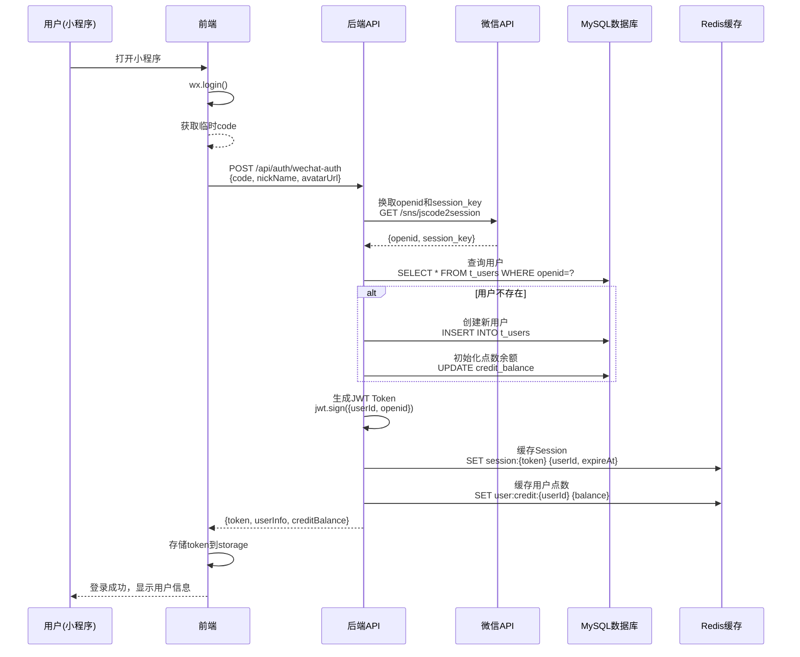
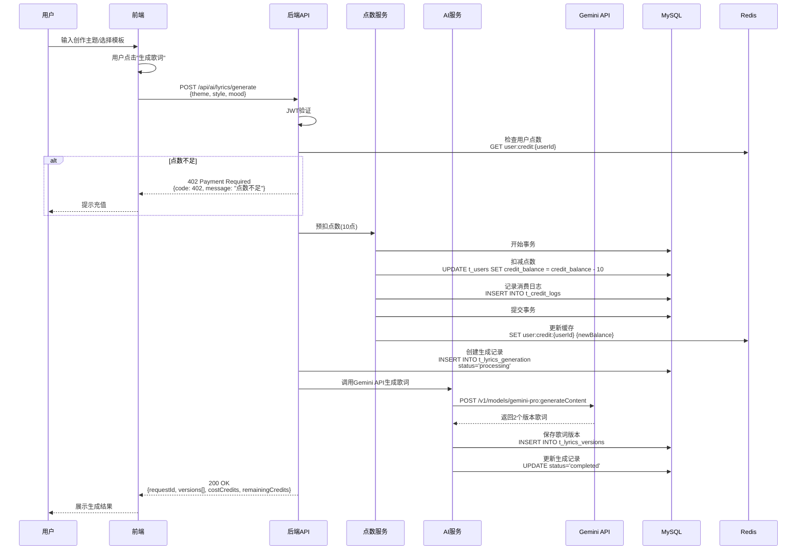
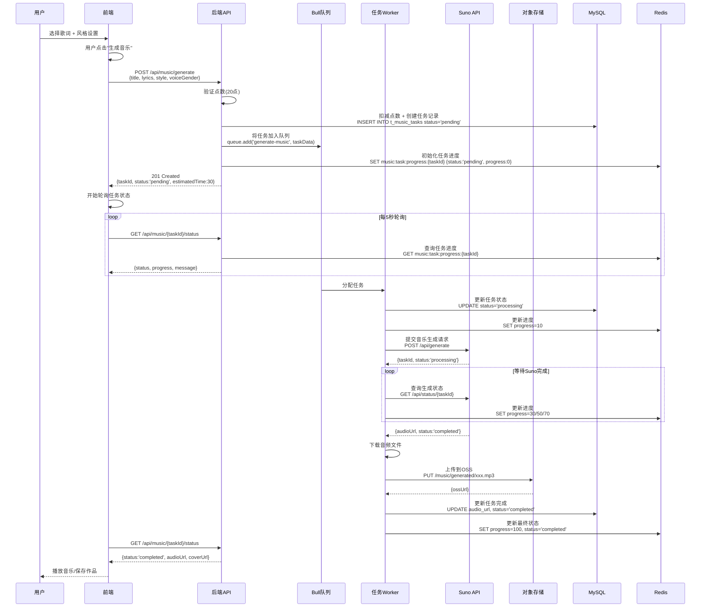
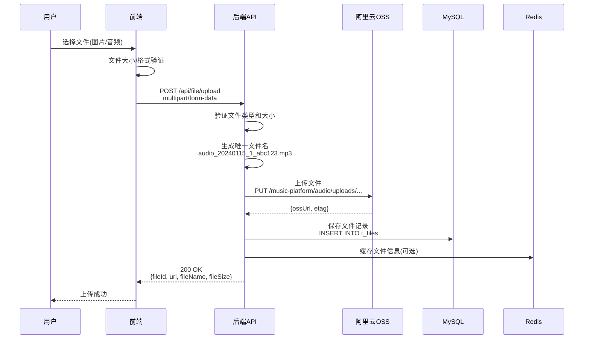

# AI音乐创作助手 - 技术架构详细设计文档

> **版本**: v1.0  
> **创建时间**: 2024年  
> **项目名称**: AI音乐创作助手  
> **阶段**: 第二阶段 - 技术架构详细设计

---

## 📋 目录

- [1. 模块交互流程设计](#1-模块交互流程设计)
- [2. 异常处理与重试机制](#2-异常处理与重试机制)
- [3. 日志与监控方案](#3-日志与监控方案)
- [4. 性能优化策略](#4-性能优化策略)
- [5. 部署与运维方案](#5-部署与运维方案)
- [6. 安全防护方案](#6-安全防护方案)

---

## 1. 模块交互流程设计

### 1.1 用户登录认证流程



**关键点**:
1. **无状态认证**: JWT Token包含用户信息，无需频繁查库
2. **Session缓存**: Redis存储Token映射，快速验证
3. **安全保护**: session_key不存MySQL，只存Redis且设置过期
4. **自动注册**: 首次登录自动创建用户，赠送初始点数

---

### 1.2 AI歌词生成完整流程



**关键点**:
1. **点数预扣**: 生成前先扣点数，防止恶意调用
2. **事务保证**: 点数扣减和日志记录在同一事务
3. **状态记录**: processing → completed/failed 状态流转
4. **多版本生成**: 一次请求生成2个版本供用户选择
5. **缓存同步**: 点数变更后立即更新Redis缓存

---

### 1.3 音乐生成异步任务流程



**关键点**:
1. **异步处理**: 使用Bull队列异步处理耗时任务
2. **任务状态**: pending → processing → completed/failed
3. **进度反馈**: Redis存储实时进度，前端轮询展示
4. **文件存储**: 生成的音乐上传到OSS，数据库只存URL
5. **失败重试**: Worker支持任务失败自动重试机制

---

### 1.4 文件上传流程



**关键点**:
1. **前端预验证**: 减少无效请求
2. **文件命名**: 时间戳 + 用户ID + 随机ID，避免冲突
3. **直接上传**: 后端接收后直接上传OSS，不存本地
4. **CDN加速**: OSS配置CDN，加速文件访问
5. **记录保存**: 数据库记录文件元信息，便于管理

---

## 2. 异常处理与重试机制

### 2.1 异常分类体系

```typescript
// 自定义异常基类
export abstract class BaseException extends Error {
  constructor(
    public readonly code: number,
    public readonly message: string,
    public readonly error?: string,
  ) {
    super(message);
  }
}

// 业务异常
export class BusinessException extends BaseException {}

// 系统异常
export class SystemException extends BaseException {}

// 外部API异常
export class ExternalApiException extends BaseException {}
```

### 2.2 常见异常场景及处理

#### 2.2.1 点数不足

```typescript
// Service层
async generateLyrics(userId: number, params: GenerateLyricsDto) {
  const balance = await this.creditService.getBalance(userId);
  
  if (balance < 10) {
    throw new BusinessException(
      402,
      '点数不足，请先充值',
      'INSUFFICIENT_CREDITS'
    );
  }
  
  // ... 继续业务逻辑
}

// Controller层
@Post('lyrics/generate')
async generateLyrics(@Request() req, @Body() params: GenerateLyricsDto) {
  try {
    return await this.aiService.generateLyrics(req.user.id, params);
  } catch (error) {
    if (error instanceof BusinessException) {
      throw new HttpException(
        {
          code: error.code,
          message: error.message,
          error: error.error,
        },
        HttpStatus.PAYMENT_REQUIRED,
      );
    }
    throw error;
  }
}
```

---

#### 2.2.2 Gemini API调用失败

```typescript
async callGeminiAPI(prompt: string, retries = 3): Promise<string> {
  for (let i = 0; i < retries; i++) {
    try {
      const response = await this.geminiClient.generateContent({
        model: 'gemini-pro',
        prompt: prompt,
      });
      
      return response.text;
      
    } catch (error) {
      this.logger.error(`Gemini API调用失败 (第${i+1}次): ${error.message}`);
      
      // 最后一次尝试，抛出异常
      if (i === retries - 1) {
        throw new ExternalApiException(
          503,
          'AI服务暂时不可用，请稍后重试',
          'GEMINI_API_UNAVAILABLE'
        );
      }
      
      // 指数退避策略
      const backoffTime = Math.pow(2, i) * 1000; // 1s, 2s, 4s
      await this.sleep(backoffTime);
    }
  }
}
```

---

#### 2.2.3 数据库连接失败

```typescript
// 数据库连接配置
@Module({
  imports: [
    TypeOrmModule.forRoot({
      type: 'mysql',
      host: process.env.DB_HOST,
      port: parseInt(process.env.DB_PORT),
      username: process.env.DB_USERNAME,
      password: process.env.DB_PASSWORD,
      database: process.env.DB_DATABASE,
      
      // 连接池配置
      extra: {
        connectionLimit: 10,
        waitForConnections: true,
        queueLimit: 0,
      },
      
      // 自动重连
      autoLoadEntities: true,
      keepConnectionAlive: true,
      
      // 重试策略
      retryAttempts: 3,
      retryDelay: 3000,
    }),
  ],
})
export class AppModule {}

// 数据库操作异常捕获
async findUserById(id: number): Promise<User> {
  try {
    return await this.userRepository.findOne({ where: { id } });
  } catch (error) {
    if (error.code === 'ECONNREFUSED') {
      this.logger.error('数据库连接失败');
      throw new SystemException(
        503,
        '服务暂时不可用',
        'DATABASE_UNAVAILABLE'
      );
    }
    throw error;
  }
}
```

---

### 2.3 任务重试机制

#### 2.3.1 Bull队列重试配置

```typescript
// 音乐生成任务队列配置
export const MUSIC_QUEUE_OPTIONS: QueueOptions = {
  defaultJobOptions: {
    attempts: 3,              // 最多重试3次
    backoff: {
      type: 'exponential',    // 指数退避
      delay: 5000,            // 初始延迟5秒
    },
    removeOnComplete: false,  // 完成后保留记录
    removeOnFail: false,      // 失败后保留记录
  },
};

// Worker任务处理
@Process('generate-music')
async handleMusicGeneration(job: Job<MusicTaskData>) {
  const { taskId, userId, title, lyrics, style } = job.data;
  
  try {
    // 更新任务状态
    await this.updateTaskStatus(taskId, 'processing');
    
    // 调用Suno API
    const result = await this.sunoService.generateMusic({
      lyrics,
      style,
    });
    
    // 下载并上传到OSS
    const ossUrl = await this.uploadToOSS(result.audioUrl);
    
    // 更新任务完成
    await this.updateTaskStatus(taskId, 'completed', {
      audioUrl: ossUrl,
    });
    
    return { success: true, taskId };
    
  } catch (error) {
    this.logger.error(`任务${taskId}失败: ${error.message}`);
    
    // 判断是否需要重试
    if (job.attemptsMade < job.opts.attempts) {
      throw error; // 抛出错误，触发重试
    } else {
      // 达到最大重试次数，标记失败
      await this.updateTaskStatus(taskId, 'failed', {
        errorMessage: error.message,
      });
      
      // 退还点数
      await this.creditService.refund(userId, 20, '音乐生成失败退款');
    }
  }
}
```

---

### 2.4 全局异常过滤器

```typescript
@Catch()
export class GlobalExceptionFilter implements ExceptionFilter {
  constructor(private readonly logger: Logger) {}

  catch(exception: unknown, host: ArgumentsHost) {
    const ctx = host.switchToHttp();
    const response = ctx.getResponse<Response>();
    const request = ctx.getRequest<Request>();

    let status = HttpStatus.INTERNAL_SERVER_ERROR;
    let message = 'Internal server error';
    let error = 'INTERNAL_ERROR';

    // 业务异常
    if (exception instanceof BusinessException) {
      status = HttpStatus.UNPROCESSABLE_ENTITY;
      message = exception.message;
      error = exception.error;
    }
    // HTTP异常
    else if (exception instanceof HttpException) {
      status = exception.getStatus();
      const exceptionResponse = exception.getResponse();
      message = typeof exceptionResponse === 'string' 
        ? exceptionResponse 
        : (exceptionResponse as any).message;
    }
    // 系统异常
    else if (exception instanceof Error) {
      this.logger.error(
        `Unhandled Error: ${exception.message}`,
        exception.stack,
      );
    }

    response.status(status).json({
      code: status,
      message: message,
      error: error,
      timestamp: new Date().toISOString(),
      path: request.url,
    });
  }
}
```

---

## 3. 日志与监控方案

### 3.1 日志系统设计

#### 3.1.1 日志分级

```typescript
export enum LogLevel {
  ERROR = 'error',   // 错误：影响系统功能
  WARN = 'warn',     // 警告：潜在问题
  INFO = 'info',     // 信息：重要业务流程
  DEBUG = 'debug',   // 调试：开发调试信息
}
```

#### 3.1.2 Winston日志配置

```typescript
import * as winston from 'winston';
import 'winston-daily-rotate-file';

// 日志格式
const logFormat = winston.format.combine(
  winston.format.timestamp({ format: 'YYYY-MM-DD HH:mm:ss' }),
  winston.format.errors({ stack: true }),
  winston.format.splat(),
  winston.format.json(),
);

// 按日期分割日志文件
const dailyRotateFileTransport = new winston.transports.DailyRotateFile({
  filename: 'logs/%DATE%-combined.log',
  datePattern: 'YYYY-MM-DD',
  maxSize: '20m',
  maxFiles: '30d',
  format: logFormat,
});

// 错误日志单独存储
const errorFileTransport = new winston.transports.DailyRotateFile({
  level: 'error',
  filename: 'logs/%DATE%-error.log',
  datePattern: 'YYYY-MM-DD',
  maxSize: '20m',
  maxFiles: '30d',
  format: logFormat,
});

// 创建Logger实例
export const logger = winston.createLogger({
  level: process.env.LOG_LEVEL || 'info',
  format: logFormat,
  transports: [
    dailyRotateFileTransport,
    errorFileTransport,
    new winston.transports.Console({
      format: winston.format.combine(
        winston.format.colorize(),
        winston.format.simple(),
      ),
    }),
  ],
});
```

---

#### 3.1.3 结构化日志记录

```typescript
// 业务日志记录示例
export class AIService {
  constructor(private readonly logger: Logger) {}

  async generateLyrics(userId: number, params: GenerateLyricsDto) {
    const requestId = uuidv4();
    
    // 开始日志
    this.logger.log({
      level: 'info',
      message: 'AI歌词生成开始',
      requestId,
      userId,
      theme: params.theme,
      style: params.style,
    });
    
    try {
      const result = await this.callGeminiAPI(params);
      
      // 成功日志
      this.logger.log({
        level: 'info',
        message: 'AI歌词生成成功',
        requestId,
        userId,
        versionsCount: result.versions.length,
        duration: Date.now() - startTime,
      });
      
      return result;
      
    } catch (error) {
      // 错误日志
      this.logger.error({
        message: 'AI歌词生成失败',
        requestId,
        userId,
        error: error.message,
        stack: error.stack,
      });
      
      throw error;
    }
  }
}
```

---

### 3.2 性能监控

#### 3.2.1 API响应时间监控

```typescript
// 中间件：记录API响应时间
@Injectable()
export class PerformanceMiddleware implements NestMiddleware {
  use(req: Request, res: Response, next: NextFunction) {
    const startTime = Date.now();
    
    res.on('finish', () => {
      const duration = Date.now() - startTime;
      
      // 记录响应时间
      this.logger.log({
        message: 'API Performance',
        method: req.method,
        url: req.url,
        statusCode: res.statusCode,
        duration: `${duration}ms`,
        userId: req['user']?.id,
      });
      
      // 慢查询告警（超过2秒）
      if (duration > 2000) {
        this.logger.warn({
          message: 'Slow API Warning',
          method: req.method,
          url: req.url,
          duration: `${duration}ms`,
        });
      }
    });
    
    next();
  }
}
```

---

#### 3.2.2 数据库查询监控

```typescript
// TypeORM查询日志
@Module({
  imports: [
    TypeOrmModule.forRoot({
      // ... 其他配置
      logging: ['error', 'warn', 'query'],
      logger: 'advanced-console',
      maxQueryExecutionTime: 1000, // 查询超过1秒记录警告
    }),
  ],
})
```

---

#### 3.2.3 Redis性能监控

```typescript
// Redis监控中间件
export class RedisMonitor {
  constructor(private readonly redis: Redis) {
    // 监听Redis事件
    redis.on('connect', () => {
      logger.info('Redis连接成功');
    });
    
    redis.on('error', (error) => {
      logger.error('Redis错误', { error: error.message });
    });
    
    redis.on('slow', (command) => {
      logger.warn('Redis慢查询', {
        command: command.name,
        args: command.args,
        duration: command.duration,
      });
    });
  }
}
```

---

### 3.3 业务监控指标

#### 3.3.1 核心指标

```typescript
export interface BusinessMetrics {
  // 用户相关
  dailyActiveUsers: number;        // 日活用户
  newRegistrations: number;         // 新注册用户
  
  // 创作相关
  lyricsGeneratedCount: number;     // 歌词生成次数
  musicGeneratedCount: number;      // 音乐生成次数
  successRate: number;              // 生成成功率
  
  // 点数相关
  creditsPurchased: number;         // 点数购买金额
  creditsConsumed: number;          // 点数消费总量
  
  // 性能相关
  avgApiResponseTime: number;       // API平均响应时间
  apiErrorRate: number;             // API错误率
  
  // 外部API
  geminiApiCalls: number;           // Gemini调用次数
  sunoApiCalls: number;             // Suno调用次数
  externalApiErrorRate: number;     // 外部API错误率
}
```

---

#### 3.3.2 监控数据收集

```typescript
@Injectable()
export class MetricsService {
  constructor(
    private readonly redis: Redis,
    private readonly mysql: DataSource,
  ) {}
  
  // 记录业务指标
  async recordMetric(metric: string, value: number, tags?: Record<string, string>) {
    const date = new Date().toISOString().split('T')[0];
    const key = `metrics:${metric}:${date}`;
    
    // Redis中累加计数
    await this.redis.hincrby(key, JSON.stringify(tags || {}), value);
    
    // 设置过期时间30天
    await this.redis.expire(key, 30 * 24 * 3600);
  }
  
  // 获取指标统计
  async getMetrics(metric: string, startDate: string, endDate: string) {
    const keys = this.generateDateKeys(metric, startDate, endDate);
    const results = await this.redis.mget(...keys);
    
    return results.map((result, index) => ({
      date: this.extractDateFromKey(keys[index]),
      value: parseInt(result || '0'),
    }));
  }
}
```

---

### 3.4 告警机制

#### 3.4.1 告警规则

```typescript
export const ALERT_RULES = {
  // API错误率超过5%
  highErrorRate: {
    metric: 'apiErrorRate',
    threshold: 0.05,
    window: '5m',
    severity: 'critical',
  },
  
  // API响应时间超过2秒
  slowResponse: {
    metric: 'avgApiResponseTime',
    threshold: 2000,
    window: '5m',
    severity: 'warning',
  },
  
  // Redis连接失败
  redisDown: {
    metric: 'redisConnectionError',
    threshold: 1,
    window: '1m',
    severity: 'critical',
  },
  
  // 数据库连接失败
  databaseDown: {
    metric: 'databaseConnectionError',
    threshold: 1,
    window: '1m',
    severity: 'critical',
  },
  
  // Gemini API错误率超过10%
  geminiApiError: {
    metric: 'geminiApiErrorRate',
    threshold: 0.10,
    window: '5m',
    severity: 'warning',
  },
};
```

---

#### 3.4.2 告警通知

```typescript
@Injectable()
export class AlertService {
  async sendAlert(rule: AlertRule, currentValue: number) {
    const message = `
      【告警】${rule.severity.toUpperCase()}
      
      指标: ${rule.metric}
      当前值: ${currentValue}
      阈值: ${rule.threshold}
      时间窗口: ${rule.window}
      
      请及时处理！
    `;
    
    // 发送钉钉/企业微信通知
    await this.sendDingTalkNotification(message);
    
    // 发送邮件通知
    await this.sendEmailNotification(message);
    
    // 记录告警历史
    await this.logAlert(rule, currentValue);
  }
}
```

---

## 4. 性能优化策略

### 4.1 数据库优化

#### 4.1.1 索引优化

```sql
-- 1. 用户表优化
ALTER TABLE t_users 
  ADD INDEX idx_openid (openid),
  ADD INDEX idx_phone (phone),
  ADD INDEX idx_created_at (created_at),
  ADD INDEX idx_credit_balance (credit_balance);

-- 2. 作品表优化（联合索引）
ALTER TABLE t_works
  ADD INDEX idx_user_visibility (user_id, visibility, is_deleted),
  ADD INDEX idx_created_at_desc (created_at DESC);

-- 3. 点数记录表优化（覆盖索引）
ALTER TABLE t_credit_logs
  ADD INDEX idx_user_created (user_id, created_at DESC);

-- 4. 音乐任务表优化
ALTER TABLE t_music_tasks
  ADD INDEX idx_user_status (user_id, status),
  ADD INDEX idx_status_created (status, created_at);

-- 5. 热门推荐表优化
ALTER TABLE t_hot_recommendations
  ADD INDEX idx_category_active_sort (category, is_active, sort_order),
  ADD INDEX idx_play_count (play_count DESC);
```

---

#### 4.1.2 查询优化

```typescript
// ❌ 不好的查询（N+1问题）
async getUserWorks(userId: number) {
  const works = await this.workRepository.find({ 
    where: { userId } 
  });
  
  // 循环查询用户信息，产生N+1问题
  for (const work of works) {
    work.author = await this.userRepository.findOne({ 
      where: { id: work.userId } 
    });
  }
  
  return works;
}

// ✅ 优化后的查询（使用JOIN）
async getUserWorks(userId: number) {
  return await this.workRepository
    .createQueryBuilder('work')
    .leftJoinAndSelect('work.author', 'user')
    .where('work.userId = :userId', { userId })
    .andWhere('work.isDeleted = :isDeleted', { isDeleted: false })
    .orderBy('work.createdAt', 'DESC')
    .getMany();
}
```

---

#### 4.1.3 分页优化

```typescript
// ✅ 基于游标的分页（适合大数据量）
async getUserWorksWithCursor(
  userId: number,
  cursor?: number,
  limit: number = 20,
) {
  const query = this.workRepository
    .createQueryBuilder('work')
    .where('work.userId = :userId', { userId })
    .andWhere('work.isDeleted = :isDeleted', { isDeleted: false })
    .orderBy('work.id', 'DESC')
    .limit(limit + 1); // 多查询一条用于判断是否还有下一页
  
  if (cursor) {
    query.andWhere('work.id < :cursor', { cursor });
  }
  
  const works = await query.getMany();
  
  const hasMore = works.length > limit;
  if (hasMore) {
    works.pop(); // 移除多查询的那一条
  }
  
  return {
    items: works,
    hasMore,
    nextCursor: hasMore ? works[works.length - 1].id : null,
  };
}
```

---

### 4.2 缓存优化

#### 4.2.1 多级缓存

```typescript
@Injectable()
export class CacheService {
  // L1: 内存缓存（本地缓存，极快）
  private memoryCache = new Map<string, any>();
  
  constructor(
    // L2: Redis缓存（分布式缓存，快）
    private readonly redis: Redis,
    // L3: 数据库（持久化存储，慢）
    private readonly mysql: DataSource,
  ) {}
  
  async get<T>(key: string, fetchFn: () => Promise<T>, ttl: number = 300): Promise<T> {
    // L1: 内存缓存查询
    if (this.memoryCache.has(key)) {
      return this.memoryCache.get(key);
    }
    
    // L2: Redis缓存查询
    const redisValue = await this.redis.get(key);
    if (redisValue) {
      const value = JSON.parse(redisValue);
      // 回填L1缓存
      this.memoryCache.set(key, value);
      return value;
    }
    
    // L3: 数据库查询
    const value = await fetchFn();
    
    // 回填L2缓存
    await this.redis.setex(key, ttl, JSON.stringify(value));
    
    // 回填L1缓存
    this.memoryCache.set(key, value);
    
    return value;
  }
  
  async invalidate(key: string) {
    // 清除所有层级缓存
    this.memoryCache.delete(key);
    await this.redis.del(key);
  }
}
```

---

#### 4.2.2 缓存预热

```typescript
@Injectable()
export class CacheWarmupService {
  async warmupCache() {
    // 预热热门推荐
    await this.warmupHotRecommendations();
    
    // 预热创作提示词
    await this.warmupPromptTemplates();
    
    // 预热Banner
    await this.warmupBanners();
  }
  
  private async warmupHotRecommendations() {
    const recommendations = await this.mysql
      .getRepository(HotRecommendation)
      .find({ where: { isActive: true } });
    
    // 按分类缓存
    const groupedByCategory = this.groupBy(recommendations, 'category');
    
    for (const [category, items] of Object.entries(groupedByCategory)) {
      await this.redis.setex(
        `hot:music:list:${category}:1`,
        1800, // 30分钟
        JSON.stringify(items),
      );
    }
  }
}
```

---

### 4.3 API优化

#### 4.3.1 数据压缩

```typescript
// 启用GZIP压缩
import * as compression from 'compression';

async function bootstrap() {
  const app = await NestFactory.create(AppModule);
  
  // 启用压缩中间件
  app.use(compression({
    threshold: 1024, // 大于1KB的响应才压缩
    level: 6,        // 压缩级别（1-9）
  }));
  
  await app.listen(3000);
}
```

---

#### 4.3.2 响应字段筛选

```typescript
// DTO: 控制响应字段
export class WorkResponseDto {
  id: number;
  title: string;
  coverUrl: string;
  duration: string;
  
  // ❌ 不返回歌词内容（节省带宽）
  // lyrics: string;
  
  @Expose({ groups: ['detail'] })
  lyrics?: string;  // 只在详情接口返回
}

// Controller
@Get('list')
async getList(@Query() query: ListQueryDto) {
  const works = await this.workService.findAll(query);
  return plainToClass(WorkResponseDto, works, { excludeExtraneousValues: true });
}

@Get(':id')
async getDetail(@Param('id') id: number) {
  const work = await this.workService.findOne(id);
  return plainToClass(WorkResponseDto, work, { 
    groups: ['detail'],
    excludeExtraneousValues: true 
  });
}
```

---

### 4.4 前端优化建议

```typescript
// 1. 图片懒加载
<image :src="coverUrl" lazy-load mode="aspectFill"></image>

// 2. 虚拟列表（长列表优化）
<recycle-list :list="musicList" :item-height="120">
  <template v-slot="{ item }">
    <music-item :item="item"></music-item>
  </template>
</recycle-list>

// 3. 防抖/节流
// utils/debounce.js
export function debounce(fn, delay = 300) {
  let timer = null;
  return function(...args) {
    if (timer) clearTimeout(timer);
    timer = setTimeout(() => {
      fn.apply(this, args);
    }, delay);
  };
}

// 使用
onSearchInput: debounce(function(keyword) {
  this.searchMusic(keyword);
}, 500),

// 4. 数据分页加载
async loadMore() {
  if (this.loading || this.isEnd) return;
  
  this.loading = true;
  this.page++;
  
  const newData = await this.$api.getMusicList({
    page: this.page,
    pageSize: 20,
  });
  
  this.musicList = [...this.musicList, ...newData.items];
  this.isEnd = newData.items.length < 20;
  this.loading = false;
}
```

---

## 5. 部署与运维方案

### 5.1 Docker容器化部署

#### 5.1.1 Dockerfile

\`\`\`dockerfile
# 基础镜像
FROM node:18-alpine AS base

# 设置工作目录
WORKDIR /app

# 复制package文件
COPY package*.json ./

# 安装依赖
RUN npm ci --only=production

# 构建阶段
FROM base AS builder
WORKDIR /app
COPY . .
RUN npm run build

# 生产阶段
FROM node:18-alpine
WORKDIR /app

# 复制依赖和构建产物
COPY --from=base /app/node_modules ./node_modules
COPY --from=builder /app/dist ./dist
COPY package*.json ./

# 暴露端口
EXPOSE 3000

# 启动应用
CMD ["node", "dist/main.js"]
\`\`\`

---

#### 5.1.2 docker-compose.yml

\`\`\`yaml
version: '3.8'

services:
  # 后端API服务
  api:
    build:
      context: .
      dockerfile: Dockerfile
    ports:
      - "3000:3000"
    environment:
      - NODE_ENV=production
      - DB_HOST=mysql
      - DB_PORT=3306
      - REDIS_HOST=redis
      - REDIS_PORT=6379
    depends_on:
      - mysql
      - redis
    restart: unless-stopped

  # MySQL数据库
  mysql:
    image: mysql:8.0
    ports:
      - "3306:3306"
    environment:
      - MYSQL_ROOT_PASSWORD=root123456
      - MYSQL_DATABASE=music_platform
    volumes:
      - mysql_data:/var/lib/mysql
      - ./init.sql:/docker-entrypoint-initdb.d/init.sql
    restart: unless-stopped

  # Redis缓存
  redis:
    image: redis:7-alpine
    ports:
      - "6379:6379"
    volumes:
      - redis_data:/data
    command: redis-server --appendonly yes
    restart: unless-stopped

volumes:
  mysql_data:
  redis_data:
\`\`\`

---

### 5.2 Nginx反向代理配置

\`\`\`nginx
upstream api_backend {
    server 127.0.0.1:3000 max_fails=3 fail_timeout=30s;
    # 如果有多个实例，添加负载均衡
    # server 127.0.0.1:3001 max_fails=3 fail_timeout=30s;
    keepalive 32;
}

server {
    listen 80;
    server_name api.your-domain.com;
    
    # HTTP重定向到HTTPS
    return 301 https://$server_name$request_uri;
}

server {
    listen 443 ssl http2;
    server_name api.your-domain.com;
    
    # SSL证书配置
    ssl_certificate /etc/nginx/ssl/your-domain.crt;
    ssl_certificate_key /etc/nginx/ssl/your-domain.key;
    
    # SSL优化
    ssl_protocols TLSv1.2 TLSv1.3;
    ssl_ciphers HIGH:!aNULL:!MD5;
    ssl_prefer_server_ciphers on;
    
    # 日志配置
    access_log /var/log/nginx/api_access.log;
    error_log /var/log/nginx/api_error.log;
    
    # API代理
    location /api/ {
        proxy_pass http://api_backend;
        proxy_http_version 1.1;
        
        # 代理头部
        proxy_set_header Host $host;
        proxy_set_header X-Real-IP $remote_addr;
        proxy_set_header X-Forwarded-For $proxy_add_x_forwarded_for;
        proxy_set_header X-Forwarded-Proto $scheme;
        
        # 超时配置
        proxy_connect_timeout 60s;
        proxy_send_timeout 60s;
        proxy_read_timeout 60s;
        
        # Keepalive
        proxy_set_header Connection "";
    }
    
    # 文件上传大小限制
    client_max_body_size 50M;
}
\`\`\`

---

### 5.3 CI/CD部署流程

#### 5.3.1 GitHub Actions配置

\`\`\`yaml
name: Deploy to Production

on:
  push:
    branches:
      - main

jobs:
  test:
    runs-on: ubuntu-latest
    steps:
      - uses: actions/checkout@v3
      - uses: actions/setup-node@v3
        with:
          node-version: '18'
      - run: npm ci
      - run: npm run lint
      - run: npm run test

  build-and-deploy:
    needs: test
    runs-on: ubuntu-latest
    steps:
      - uses: actions/checkout@v3
      
      - name: Build Docker image
        run: docker build -t music-api:latest .
      
      - name: Push to Registry
        run: |
          docker tag music-api:latest registry.example.com/music-api:latest
          docker push registry.example.com/music-api:latest
      
      - name: Deploy to Server
        uses: appleboy/ssh-action@master
        with:
          host: ${{ secrets.SERVER_HOST }}
          username: ${{ secrets.SERVER_USER }}
          key: ${{ secrets.SSH_KEY }}
          script: |
            cd /app/music-platform
            docker-compose pull
            docker-compose up -d
            docker-compose logs -f
\`\`\`

---

### 5.4 数据备份策略

#### 5.4.1 MySQL自动备份脚本

\`\`\`bash
#!/bin/bash
# mysql_backup.sh

BACKUP_DIR="/backup/mysql"
DATE=$(date +%Y%m%d_%H%M%S)
DB_NAME="music_platform"
DB_USER="root"
DB_PASS="root123456"

# 创建备份目录
mkdir -p $BACKUP_DIR

# 执行备份
mysqldump -u$DB_USER -p$DB_PASS $DB_NAME | gzip > $BACKUP_DIR/${DB_NAME}_${DATE}.sql.gz

# 删除30天前的备份
find $BACKUP_DIR -name "*.sql.gz" -mtime +30 -delete

echo "Backup completed: ${DB_NAME}_${DATE}.sql.gz"
\`\`\`

#### 5.4.2 定时任务配置

\`\`\`bash
# 添加到crontab
# 每天凌晨2点执行备份
0 2 * * * /backup/scripts/mysql_backup.sh >> /backup/logs/backup.log 2>&1
\`\`\`

---

## 6. 安全防护方案

### 6.1 API安全

#### 6.1.1 频率限制（Rate Limiting）

\`\`\`typescript
import { ThrottlerModule } from '@nestjs/throttler';

@Module({
  imports: [
    ThrottlerModule.forRoot({
      ttl: 60,      // 时间窗口（秒）
      limit: 60,    // 时间窗口内最大请求数
    }),
  ],
})
export class AppModule {}

// 应用到Controller
@UseGuards(ThrottlerGuard)
@Controller('api')
export class ApiController {
  // 全局限制：60次/分钟
  
  @Throttle(5, 60)  // 覆盖全局限制：5次/分钟
  @Post('ai/lyrics/generate')
  async generateLyrics() {
    // AI接口限制更严格
  }
}
\`\`\`

---

#### 6.1.2 SQL注入防护

\`\`\`typescript
// ✅ 使用参数化查询（安全）
const users = await this.userRepository
  .createQueryBuilder('user')
  .where('user.email = :email', { email: userInput })
  .getMany();

// ❌ 字符串拼接（危险，禁止使用）
const query = \`SELECT * FROM users WHERE email = '\${userInput}'\`;
\`\`\`

---

#### 6.1.3 XSS防护

\`\`\`typescript
import * as xss from 'xss';

@Injectable()
export class SanitizeService {
  sanitizeHtml(input: string): string {
    return xss(input, {
      whiteList: {},  // 不允许任何HTML标签
      stripIgnoreTag: true,
    });
  }
}

// 应用到DTO
export class CreateWorkDto {
  @Transform(({ value }) => xss(value))
  @IsString()
  @MaxLength(128)
  title: string;
  
  @Transform(({ value }) => xss(value))
  @IsString()
  @MaxLength(10000)
  lyrics: string;
}
\`\`\`

---

### 6.2 数据加密

#### 6.2.1 敏感信息加密

\`\`\`typescript
import * as crypto from 'crypto';

@Injectable()
export class EncryptionService {
  private readonly algorithm = 'aes-256-cbc';
  private readonly key = Buffer.from(process.env.ENCRYPTION_KEY, 'hex');
  private readonly iv = crypto.randomBytes(16);
  
  // 加密
  encrypt(text: string): string {
    const cipher = crypto.createCipheriv(this.algorithm, this.key, this.iv);
    let encrypted = cipher.update(text, 'utf8', 'hex');
    encrypted += cipher.final('hex');
    return this.iv.toString('hex') + ':' + encrypted;
  }
  
  // 解密
  decrypt(text: string): string {
    const parts = text.split(':');
    const iv = Buffer.from(parts[0], 'hex');
    const encrypted = parts[1];
    
    const decipher = crypto.createDecipheriv(this.algorithm, this.key, iv);
    let decrypted = decipher.update(encrypted, 'hex', 'utf8');
    decrypted += decipher.final('utf8');
    return decrypted;
  }
}
\`\`\`

---

### 6.3 安全响应头

\`\`\`typescript
import * as helmet from 'helmet';

async function bootstrap() {
  const app = await NestFactory.create(AppModule);
  
  // 使用Helmet设置安全响应头
  app.use(helmet({
    contentSecurityPolicy: {
      directives: {
        defaultSrc: ["'self'"],
        styleSrc: ["'self'", "'unsafe-inline'"],
        scriptSrc: ["'self'"],
        imgSrc: ["'self'", 'data:', 'https:'],
      },
    },
    hsts: {
      maxAge: 31536000,
      includeSubDomains: true,
    },
  }));
  
  await app.listen(3000);
}
\`\`\`

---

## 总结

本技术架构文档详细设计了：

✅ **1. 模块交互流程** - 4个核心业务流程的时序图和详细说明
✅ **2. 异常处理机制** - 异常分类、重试策略、全局过滤器
✅ **3. 日志与监控** - Winston日志、性能监控、业务指标、告警机制
✅ **4. 性能优化** - 数据库优化、缓存优化、API优化、前端优化
✅ **5. 部署运维** - Docker容器化、Nginx配置、CI/CD、数据备份
✅ **6. 安全防护** - API安全、数据加密、安全响应头

---

**下一步工作**:
- 第三阶段：API文档生成（Swagger/OpenAPI）
- 第四阶段：存储方案详细设计
- 第五阶段：开发计划与任务分解

---

**文档维护**: 随项目开发持续更新

