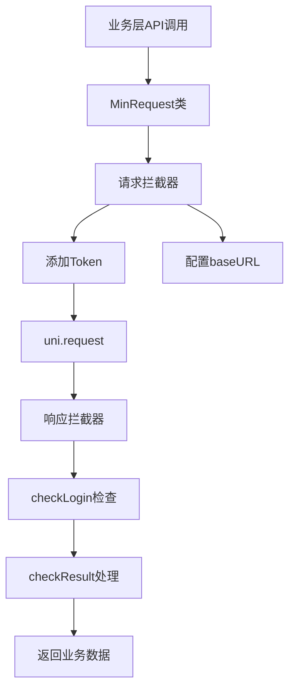
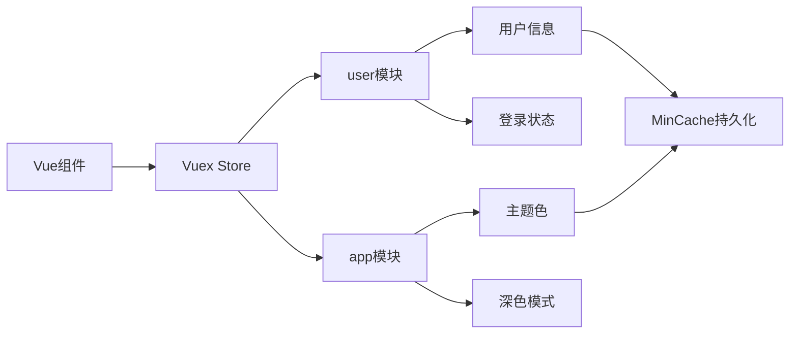
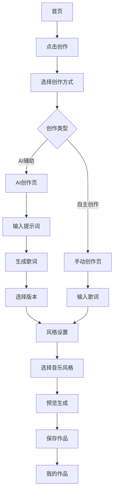
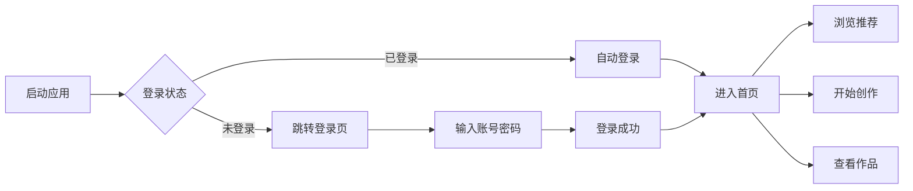

# AI音乐生成微信小程序前端项目深度分析报告

## 📋 项目概览

**项目名称**: AI音乐创作助手  
**技术框架**: uni-app (跨平台)  
**Vue版本**: Vue 2  
**项目版本**: 2.0.4  
**开发模式**: 基于uniapp-admin模板改造

---

## 1️⃣ 依赖分析

### 1.1 核心依赖 (package.json)

```json
{
  "dependencies": {
    "lodash": "^4.17.20",      // 工具函数库
    "vue-i18n": "^8.21.0"      // 国际化支持
  }
}
```

**依赖特点分析**:
- ✅ **极简依赖**: 仅2个核心依赖,体现了轻量化设计理念
- ✅ **自研基础设施**: HTTP请求、缓存、路由等均为自研实现
- ✅ **减少包体积**: 有利于小程序包大小控制

### 1.2 UI组件库

**主要UI库**:
1. **ColorUI** (`colorui/`)
   - 轻量级CSS库
   - 提供主题色彩系统
   - 图标字体支持

2. **ThorUI组件** (部分集成)
   - 日期时间选择器 (`tui-datetime.vue`)

3. **uni-ui官方组件**
   - `uni-card`: 卡片组件
   - `uni-goods-nav`: 商品导航
   - `uni-icons`: 图标组件
   - `uni-list`: 列表组件
   - `uni-nav-bar`: 导航栏
   - `uni-popup`: 弹窗组件
   - `uni-tag`: 标签组件

### 1.3 平台支持

根据 `manifest.json` 配置:
- ✅ **H5**: 支持,配置了开发服务器和代理
- ✅ **微信小程序**: 主要目标平台 (appid: wxb331c8c2878d040c)
- ✅ **支付宝小程序**: 支持
- ✅ **百度小程序**: 支持
- ✅ **头条小程序**: 支持
- ✅ **APP (Android/iOS)**: 支持,配置了推送和Webview-x5

---

## 2️⃣ 目录结构分析

```
frontend-ui/
├── api/                          # API接口层
│   └── api.js                    # 统一API管理
├── colorui/                      # ColorUI样式库
│   ├── icon.css                  # 图标样式
│   └── main.css                  # 主样式
├── components/                   # 组件库
│   ├── tui/                      # ThorUI组件
│   │   └── tui-datetime.vue      # 日期时间选择器
│   ├── uni-*/                    # uni-ui官方组件集
│   └── watch-login/              # 自定义登录组件
├── config/                       # 配置文件
│   └── index.js                  # 全局配置(API地址等)
├── hybrid/                       # 混合开发资源
│   └── html/                     # PDF.js等H5资源
├── i18n/                         # 国际化
│   ├── index.js                  # i18n配置
│   ├── en-US.js                  # 英文语言包
│   └── zh-CN.js                  # 中文语言包
├── pages/                        # 页面目录
│   ├── index/                    # 首页模块
│   │   └── index.vue             # 首页(推荐、灵感、教程)
│   ├── creation/                 # 创作模块
│   │   ├── select.vue            # 选择创作方式
│   │   ├── ai.vue                # AI辅助创作
│   │   ├── manual.vue            # 自主创作
│   │   ├── style.vue             # 风格设置
│   │   └── preview.vue           # 预览生成
│   ├── tutorial/                 # 教程模块
│   │   ├── index.vue             # 教程列表
│   │   ├── ai.vue                # AI创作教程
│   │   └── self.vue              # 自主创作教程
│   ├── user/                     # 用户中心
│   │   ├── index.vue             # 个人中心
│   │   ├── works.vue             # 我的作品
│   │   ├── work-detail.vue       # 作品详情
│   │   ├── points.vue            # 音乐点数中心
│   │   ├── settings.vue          # 系统设置
│   │   ├── agreement.vue         # 用户协议
│   │   ├── privacy.vue           # 隐私政策
│   │   ├── copyright.vue         # 版权说明
│   │   ├── help.vue              # 帮助中心
│   │   ├── feedback.vue          # 意见反馈
│   │   ├── about.vue             # 关于我们
│   │   ├── purchase.vue          # 购买点数
│   │   └── checkin.vue           # 每日签到
│   ├── recommendations/          # 推荐模块
│   │   └── index.vue             # 热门推荐
│   └── login/                    # 登录模块
│       ├── login.vue             # 登录页
│       └── forget.vue            # 忘记密码
├── router/                       # 路由配置
│   └── router.js                 # 路由管理
├── static/                       # 静态资源
│   ├── img/                      # 图片资源
│   │   ├── avatars/              # 用户头像
│   │   ├── banner/               # 轮播图
│   │   ├── covers/               # 封面图
│   │   ├── icon/                 # SVG图标
│   │   ├── inspiration/          # 灵感图片
│   │   ├── stories/              # 故事图片
│   │   ├── tabbar/               # 底部导航图标
│   │   └── tutorials/            # 教程图片
│   └── uni.ttf                   # uni-app字体
├── store/                        # Vuex状态管理
│   ├── index.js                  # store入口
│   └── modules/                  # 模块化store
│       ├── index.js              # 模块导出
│       ├── app.js                # 应用状态(主题、深色模式)
│       └── user.js               # 用户状态
├── utils/                        # 工具类
│   ├── MinRequest.js             # HTTP请求封装
│   ├── MinCache.js               # 缓存管理
│   ├── checkResponse.js          # 响应检查
│   ├── datetime.js               # 日期时间工具
│   ├── graceChecker.js           # 表单验证
│   └── index.js                  # 工具函数集合
├── App.vue                       # 应用入口
├── main.js                       # 主入口文件
├── pages.json                    # 页面配置
├── manifest.json                 # 应用配置
├── uni.scss                      # 全局样式变量
└── package.json                  # 项目依赖

```

### 目录设计亮点

1. **模块化清晰**: 按功能模块划分目录(creation、user、tutorial等)
2. **资源分类明确**: static目录下按用途细分图片资源
3. **组件复用**: components目录统一管理可复用组件
4. **配置集中**: config目录集中管理配置项

---

## 3️⃣ 核心技术架构

### 3.1 HTTP请求层架构

**文件**: [`utils/MinRequest.js`](frontend-ui/utils/MinRequest.js)



**核心特性**:
```javascript
// 1. 拦截器机制
minRequest.interceptors.request((request) => {
  // 自动添加Token
  request.header['WC-Token'] = user.ApiToken
  return request
})

// 2. 响应统一处理
minRequest.interceptors.response((response) => {
  return response.data
})

// 3. 支持多种HTTP方法
- GET: minRequest.get(url, data, options)
- POST: minRequest.post(url, data, options)
- DELETE: minRequest.delete(url, data, options)
```

**跨域解决方案**:
- **开发环境**: manifest.json配置proxy代理
- **生产环境**: Nginx反向代理

### 3.2 状态管理架构

**文件**: [`store/`](frontend-ui/store/)



**模块划分**:

1. **user模块** ([`store/modules/user.js`](frontend-ui/store/modules/user.js))
   - State: 用户信息
   - Mutations: login/logout
   - Actions: autoLogin自动登录
   - Getters: 从缓存获取用户信息

2. **app模块** ([`store/modules/app.js`](frontend-ui/store/modules/app.js))
   - State: 主题背景色、深色模式
   - Mutations: setThemeBgColor/setDarkMode
   - Getters: 带缓存的状态获取

### 3.3 缓存管理架构

**文件**: [`utils/MinCache.js`](frontend-ui/utils/MinCache.js)

**核心机制**:
```javascript
class MinCache {
  // 1. 支持过期时间
  set(name, data, timeout = 1200) {
    const cachecell = new CacheCell(data, timeout)
    // 以_开头的key持久化到localStorage
    if (name.startsWith('_')) {
      uni.setStorageSync(name, cachecell)
    }
  }
  
  // 2. 自动过期检查
  get(name) {
    return isTimeout(name) ? null : cacheMap.get(name).data
  }
  
  // 3. 统一清理
  clear() {
    uni.clearStorageSync()
    cacheMap.clear()
  }
}
```

**使用场景**:
- `_userInfo`: 用户信息持久化
- `_themeBgColor`: 主题色持久化
- `_darkMode`: 深色模式持久化
- `_lang`: 语言设置持久化

### 3.4 国际化架构

**文件**: [`i18n/`](frontend-ui/i18n/)

```javascript
// 自动检测系统语言
let lang = uni.getStorageSync('_lang').data
if (!lang || lang === 'System') {
  const res = uni.getSystemInfoSync()
  lang = res.language  // 获取系统语言
}

// 配置vue-i18n
const i18n = new VueI18n({
  locale: lang,
  fallbackLocale: 'en',
  messages: {
    'en': enUS,
    'zh-CN': zhCN
  }
})
```

---

## 4️⃣ 页面路由与业务流程

### 4.1 TabBar配置

```json
{
  "tabBar": {
    "color": "#8a8a8a",
    "selectedColor": "#3B7EFF",
    "backgroundColor": "#121212",
    "list": [
      {
        "pagePath": "pages/index/index",
        "text": "首页"
      },
      {
        "pagePath": "pages/creation/select",
        "text": "创作"
      },
      {
        "pagePath": "pages/user/index",
        "text": "我的"
      }
    ]
  }
}
```

### 4.2 核心业务流程

#### 🎵 音乐创作流程



#### 🎯 用户流程



### 4.3 页面清单

| 模块 | 页面 | 路径 | 功能说明 |
|------|------|------|----------|
| **首页** | 首页 | `/pages/index/index` | 推荐作品、创作灵感、教程入口 |
| **教程** | 教程首页 | `/pages