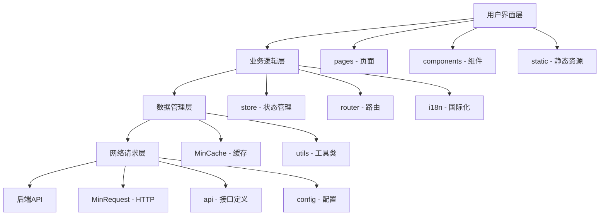

# AI音乐生成微信小程序前端项目 - 分析总结

## 📊 项目概况总览

### 基本信息
- **项目类型**: AI音乐创作微信小程序
- **技术框架**: uni-app (跨平台)
- **Vue版本**: Vue 2.x
- **项目版本**: 2.0.4
- **代码规模**: 约20+页面，10+组件

---

## ✅ 已完成的深度分析

### 1. 依赖分析 ✓
- **核心依赖**: lodash + vue-i18n (极简设计)
- **UI库**: ColorUI + ThorUI + uni-ui
- **自研组件**: MinRequest、MinCache、路由管理

### 2. 目录结构 ✓
- 清晰的模块化设计
- 标准的uni-app项目结构
- 资源分类明确

### 3. 技术架构 ✓
- **HTTP层**: 自研MinRequest + 拦截器机制
- **状态管理**: Vuex模块化(user + app)
- **缓存系统**: MinCache带过期时间管理
- **国际化**: vue-i18n支持中英文

### 4. 页面路由 ✓
- 3个TabBar页面(首页、创作、我的)
- 20+子页面
- 完整的业务流程闭环

### 5. API接口 ✓
- 用户管理接口
- 任务管理接口
- 事故管理接口
- 文件上传接口
- 统一的请求/响应处理

### 6. 组件体系 ✓
- 自定义登录组件
- uni-ui官方组件集
- ColorUI样式库
- 日期时间选择器

---

## 🎯 核心业务流程

### 音乐创作流程
```
用户进入 → 选择创作方式 → AI辅助/自主创作 → 
输入内容 → 生成歌词 → 选择风格 → 预览生成 → 
保存作品 → 我的作品
```

### 点数系统
```
查看余额 → 获取点数(购买/签到/分享/广告) → 
消耗点数(创作歌曲) → 查看明细
```

---

## 🔧 技术亮点

### 1. 跨平台能力
- ✅ H5
- ✅ 微信小程序(主要平台)
- ✅ 支付宝/百度/头条小程序
- ✅ Android/iOS APP

### 2. 自研基础设施
- **MinRequest**: 
  - 拦截器机制
  - 自动Token注入
  - 统一错误处理
  
- **MinCache**:
  - 过期时间管理
  - 持久化存储
  - 内存+localStorage双层缓存

### 3. 用户体验优化
- 自动登录机制
- 深色主题设计
- 国际化支持
- 应用自动升级

### 4. 代码质量
- 模块化设计
- 组件复用
- 配置集中管理
- 清晰的目录结构

---

## 📐 项目架构图



---

## 🎨 设计系统

### 色彩规范
- **主色**: 蓝色(#0B67EC) + 紫色(#7342CC)
- **背景**: 深色系(#121212, #1E1E1E, #2D2D2D)
- **文本**: 白色(#FFFFFF) + 灰色系(#ACACAC, #787878)
- **功能色**: 成功/警告/错误/链接

### 布局规范
- **间距**: 10/20/30/40/60rpx
- **圆角**: 10/16/24/30/100rpx
- **字体**: 22/24/28/32/36/48rpx

---

## 🚀 项目特色功能

### 1. AI音乐创作
- 提示词模板系统
- AI歌词生成(多版本)
- 音乐风格选择
- 实时预览

### 2. 用户中心
- 作品管理(云端/本地)
- 点数系统
- 签到奖励
- 分享获取点数

### 3. 教程系统
- 新手指引
- AI创作教程
- 自主创作教程
- 视频教程

---

## ⚠️ 注意事项与建议

### 当前发现的问题
1. **API接口混杂**: 
   - 存在EHS系统的API(Task/Event/Contractor)
   - 与AI音乐业务不符
   - 建议清理或重构

2. **项目命名不一致**:
   - package.json名称: uniapp-admin
   - 实际业务: AI音乐创作
   - 建议统一命名

3. **配置硬编码**:
   - IP地址写死在config/index.js
   - 建议使用环境变量

### 优化建议

#### 短期优化
1. 清理无用的API接口
2. 统一项目命名
3. 完善错误处理
4. 添加加载状态

#### 中期优化
1. 引入TypeScript
2. 组件库统一(选择一个主UI库)
3. 性能监控
4. 单元测试

#### 长期优化
1. 微前端架构
2. 服务端渲染(SSR)
3. PWA支持
4. CI/CD流程

---

## 📈 性能考虑

### 包体积优化
- ✅ 依赖精简(仅2个)
- ✅ 按需加载组件
- ⚠️ 图片资源较多(需优化)
- ⚠️ 可考虑CDN加速

### 运行性能
- ✅ 缓存机制完善
- ✅ 请求拦截优化
- ⚠️ 长列表需虚拟滚动
- ⚠️ 图片需懒加载

---

## 🔐 安全考虑

### 已实现
- ✅ Token鉴权
- ✅ 登录状态检查
- ✅ HTTPS通信

### 需加强
- ⚠️ 敏感数据加密
- ⚠️ XSS防护
- ⚠️ 接口频率限制
- ⚠️ 用户输入验证

---

## 📚 技术栈总结

### 前端技术
```
uni-app + Vue 2 + Vuex + vue-i18n
ColorUI + ThorUI + uni-ui
lodash + 自研工具库
```

### 开发工具
```
HBuilderX (推荐)
VS Code (可选)
微信开发者工具
```

### 构建部署
```
uni-app CLI
H5: Nginx
小程序: 微信开发者工具
APP: HBuilderX云打包
```

---

## 📖 相关文档

1. **详细分析报告**: 
   - [PROJECT_ANALYSIS.md](./PROJECT_ANALYSIS.md) - 第一部分
   - [PROJECT_ANALYSIS_PART2.md](./PROJECT_ANALYSIS_PART2.md) - 第二部分

2. **官方文档**:
   - [uni-app官方文档](https://uniapp.dcloud.net.cn/)
   - [Vue 2文档](https://v2.cn.vuejs.org/)
   - [ColorUI文档](https://www.color-ui.com/)

3. **项目文档**:
   - [README.md](./README.md) - 项目说明
   - [FILE_PREVIEW.md](./FILE_PREVIEW.md) - 文件预览方案
   - [PUSH_MESSAGE.md](./PUSH_MESSAGE.md) - 消息推送方案

---

## 🎓 学习价值

这个项目对于学习uni-app开发具有很高的参考价值:

### 适合学习的内容
1. ✅ uni-app跨平台开发实践
2. ✅ Vuex状态管理最佳实践
3. ✅ 自研HTTP请求库设计
4. ✅ 缓存系统设计模式
5. ✅ 国际化方案实现
6. ✅ 深色主题设计
7. ✅ 组件化开发思想

### 可以改进的地方
1. 代码注释不够完善
2. 缺少单元测试
3. 错误边界处理不足
4. 性能监控缺失

---

## 📞 联系信息

如需进一步了解项目细节或有任何疑问,请参考:
- 原项目: [uniapp-admin](https://github.com/silianpan/uniapp-admin)
- 作者: silianpan

---

**文档生成时间**: 2025-10-11  
**分析工具**: AI辅助分析  
**文档版本**: v1.0

---

## 🎯 下一步行动建议

### 对于开发者
1. 熟悉uni-app开发文档
2. 理解项目目录结构
3. 搭建本地开发环境
4. 运行并调试项目
5. 根据业务需求进行定制

### 对于项目经理
1. 评估项目技术债务
2. 规划重构计划
3. 制定开发规范
4. 建立代码审查流程
5. 完善项目文档

### 对于架构师
1. 评估现有架构合理性
2. 设计系统扩展方案
3. 制定技术选型标准
4. 规划性能优化路线
5. 建立监控体系

---

**END OF ANALYSIS** ✨